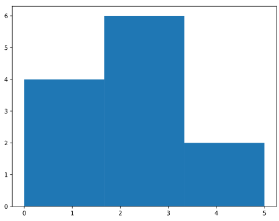

# What is a Histogram?

A **histogram** is a visualization that shows the **distribution** of numerical data. It's extremely useful for exploring datasets and understanding how values are spread out.

## How Histograms Work

1. **Divide the range** into equal-width intervals called "bins"
2. **Count** how many data points fall into each bin
3. **Draw bars** where the height represents the count (frequency)

**Example:** For 12 values between 0 and 6 divided into 3 bins:

- Data = [0,0,1,1,2,2,2,2,3,3,4,5]
- Bin 1 (0-2): 4 values → Bar height = 4 (includes 0, excludes 2)
- Bin 2 (2-4): 6 values → Bar height = 6 (includes 2, excludes 4)
- Bin 3 (4-6): 2 values → Bar height = 2 (includes 4, excludes 6)


This shows most values cluster in the middle range (2-4).

---

# Creating a Histogram in Matplotlib

To create a histogram, use `plt.hist()`:

**Example:**

```python
import matplotlib.pyplot as plt

# 12 sample values
values = [0, 0.6, 1.4, 1.6, 2.2, 2.5, 2.6, 3.2, 3.5, 3.9, 4.2, 6]

# Create histogram with 3 bins
plt.hist(values, bins=3)
plt.show()
```

## Understanding the Arguments

**`plt.hist(x, bins)`**

- **`x`** (required): List or array of values to plot
- **`bins`** (optional): Number of bins to divide the data into
  - Default: 10 bins
  - Matplotlib automatically finds appropriate boundaries
  - Automatically counts values in each bin

---

# Choosing the Number of Bins

The number of bins significantly affects how your histogram looks:

| Bins       | Effect                          |
| ---------- | ------------------------------- |
| Too few    | Oversimplifies, loses detail    |
| Too many   | Too noisy, hard to see patterns |
| Just right | Reveals meaningful patterns     |

**Tip:** Start with the default (10), then experiment to find the most informative view.

---

# Why Histograms Are Useful

Histograms help you quickly understand data distribution:

✓ **Central tendency**: Where do most values cluster?  
✓ **Spread**: Are values concentrated or dispersed?  
✓ **Shape**: Symmetric? Skewed? Multiple peaks?  
✓ **Outliers**: Unusually high or low values?

## Real-World Example: Population Pyramids

Population pyramids use horizontal histograms to show age distribution:

- Each bin represents an age range (e.g., 40-44 years)
- Separate histograms for males and females
- Comparing across years (2010 vs 2050) reveals demographic shifts

**Insight:** In 2010, the largest group was 40-44 years old (baby boomers). By 2050, the distribution flattens as this generation ages and population structure changes.

With just a glance, you can understand how entire populations evolve - that's the true power of histograms!

---

# Key Takeaways

- **Histograms** show how data is distributed across bins
- Use `plt.hist(values, bins=n)` to create histograms
- The **bins** parameter controls granularity (default is 10)
- Histograms are perfect for quickly exploring data patterns
- Experiment with different bin numbers to find the clearest view
